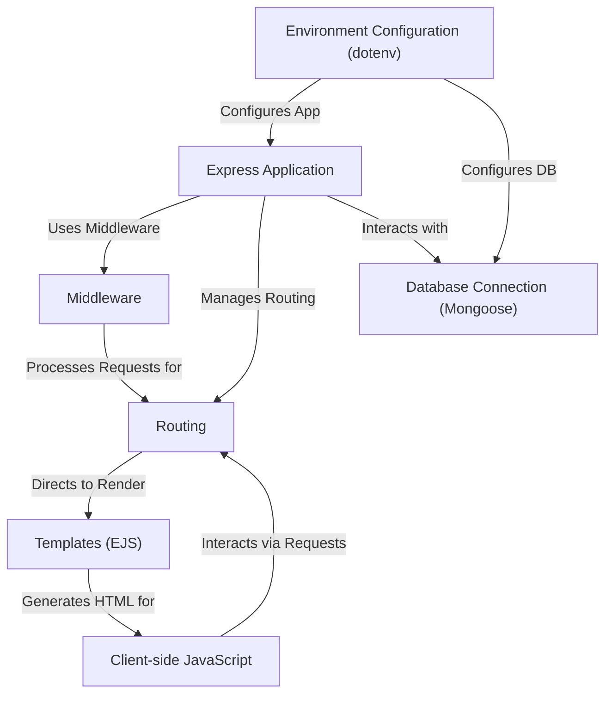

## Visual Overview

```mermaid
flowchart TD
    A0["Express Application
"]
    A1["Routing
"]
    A2["Middleware
"]
    A3["Templates (EJS)
"]
    A4["Client-side JavaScript
"]
    A5["Database Connection (Mongoose)
"]
    A6["Environment Configuration (dotenv)
"]
    A6 -- "Configures App" --> A0
    A6 -- "Configures DB" --> A5
    A0 -- "Uses Middleware" --> A2
    A0 -- "Manages Routing" --> A1
    A2 -- "Processes Requests for" --> A1
    A1 -- "Directs to Render" --> A3
    A3 -- "Generates HTML for" --> A4
    A4 -- "Interacts via Requests" --> A1
    A0 -- "Interacts with" --> A5
```
